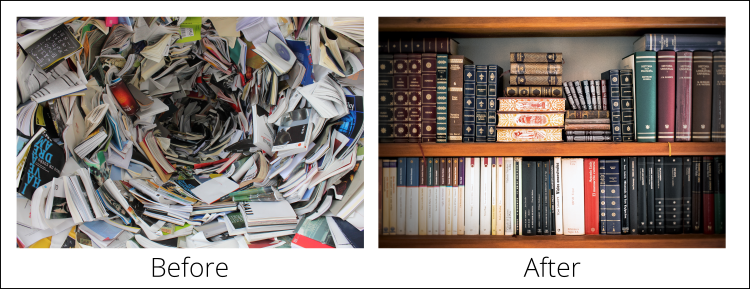

​​​​​​​​​

According to Statista, 269 billion emails were sent per day in 2017. That’s a lot of emails, and they can pile up fast - which is why it’s so important to keep your inbox under control. Emails are legal documents and should be treated with the same care as any other correspondence with clients or employees. You should endeavour to keep your inbox as a to-do list only and know how to file or delete emails as necessary so that your inbox reflects an accurate record of requests, conversations, and decisions.

Just as [Rules to Better Email](/_layouts/15/FIXUPREDIRECT.ASPX?WebId=3dfc0e07-e23a-4cbb-aac2-e778b71166a2&TermSetId=07da3ddf-0924-4cd2-a6d4-a4809ae20160&TermId=9775587d-d391-4b7d-8654-96953eeb9cfc) is about how to best write and use emails, Rules to Bett er Inbox Management covers how best to organise and store emails. An analogue equivalent to these rules might be “How to write books” and “How to organise your library”.

​​​ Figure: Don't let your inbox become a vortex of doom - keep it organised!

Keep reading to learn the rules to better inbox management!
​
​

