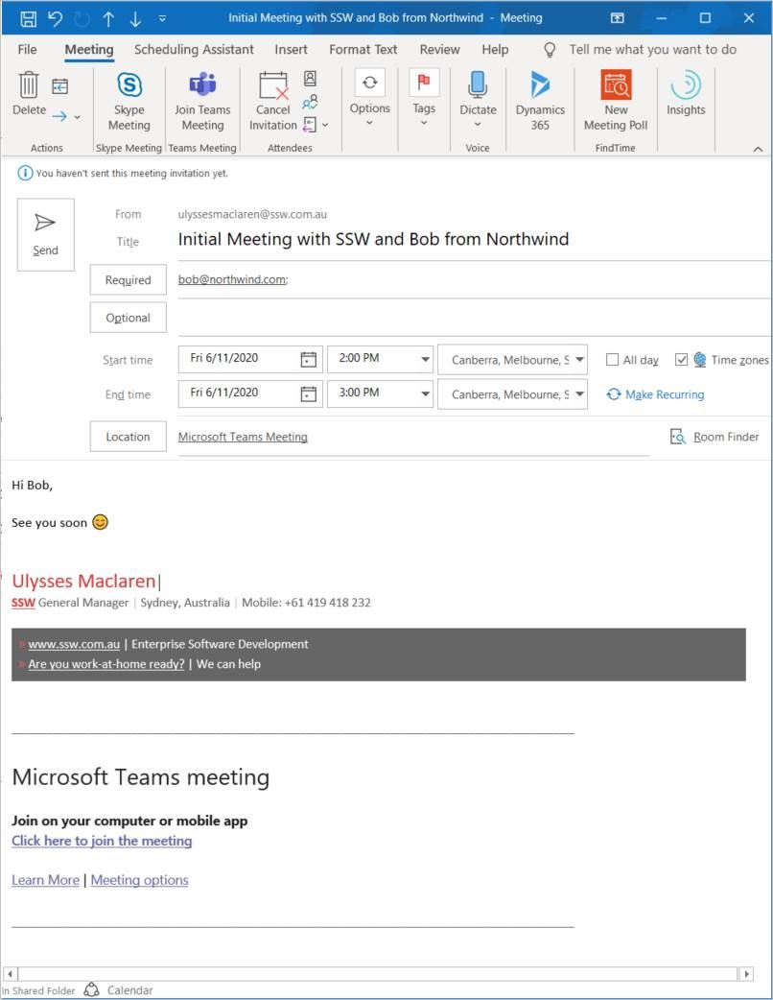

By default, when you click the button to turn an appointment into a Teams Meeting, it adds the link to join the call to the bottom of the body content. It’s generally a good idea to move this up to the top, as It’s the 1st thing you’ll want people to do when they open the appointment on the day of the meeting.

<!--endintro-->

[[badExample]]
| 
[[goodExample]]
| 
