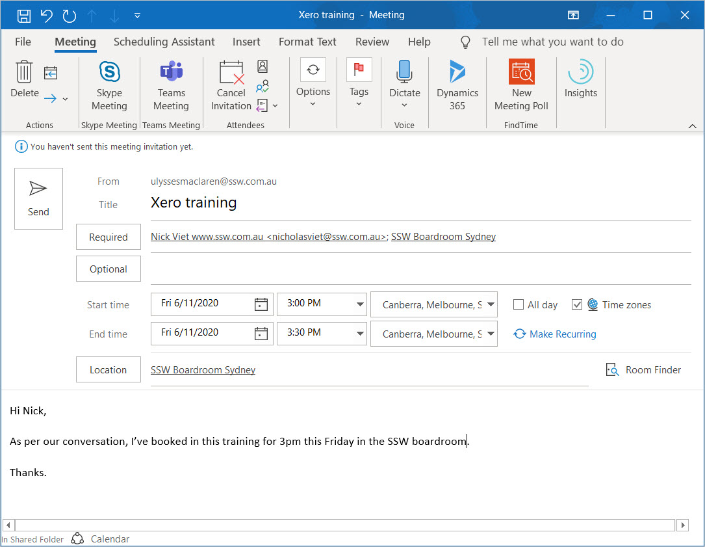
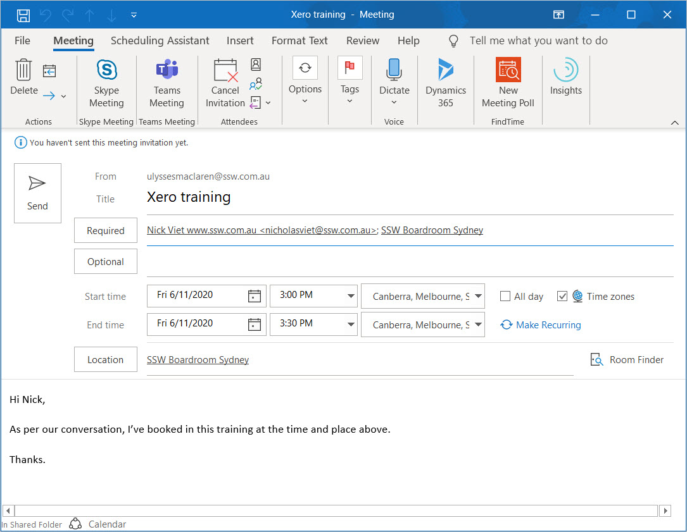

Avoid putting the date and time into the text field of a meeting since these are often overlooked when changing the meeting time/date metadata.

<!--endintro-->

[[badExample]]
| 
[[goodExample]]
| 
