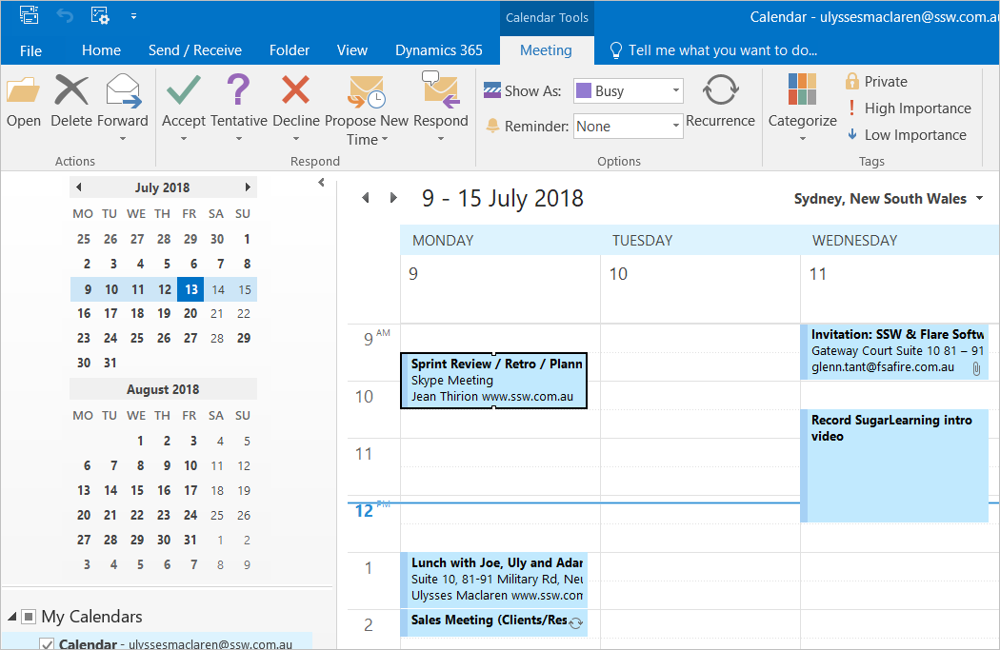
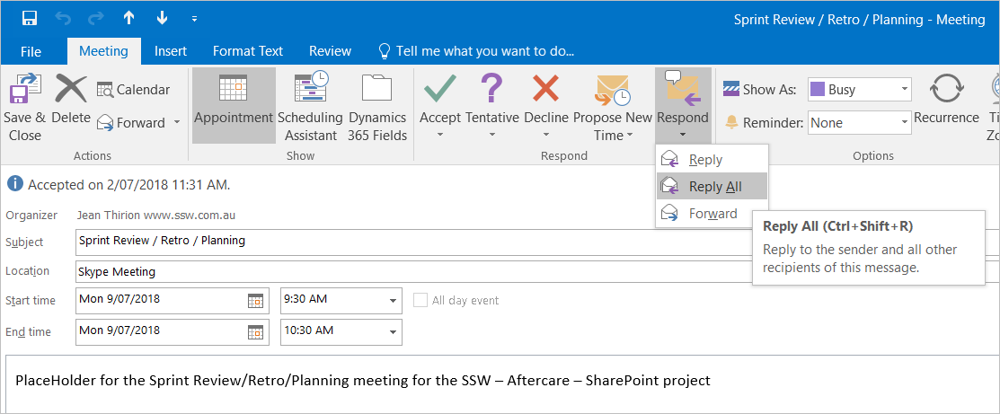
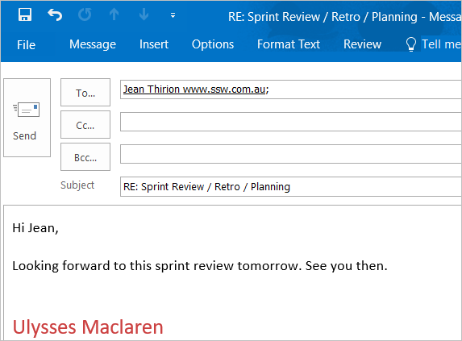

Often your conversation flow with someone will go from a phone call to emails, to an appointment, and then back to emails.

It's nice to be able to look back and see the whole history in one thread, so you will need to be able to Reply All to an appointment to continue the email conversation after the meeting.

Outlook makes this easy:

<!--endintro-->

* Option 1: Right-click on the appointment in your calendar and click "Reply All"
* Option 2: Left click on the appointment in your calendar and type "Ctrl + Shift + R"
* Option 3: Use the ribbon as below

(You should already have Invited all the required people to attend)

[[goodExample]]
| (the appointment)
Reasons you might want to "Reply All" to an Appointment include:

1. Continuing the conversation after a meeting
2. Reminding someone about an upcoming meeting (especially if you know they have unwieldy calendars)
3. Getting more information before a meeting
