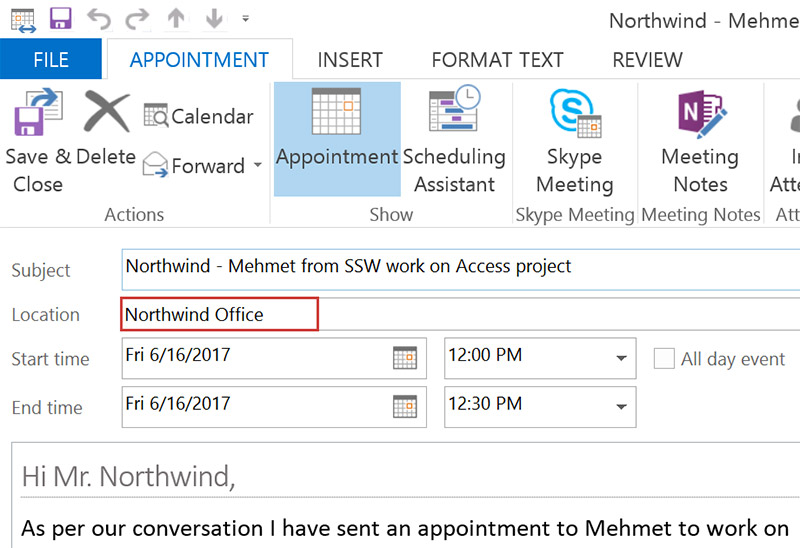
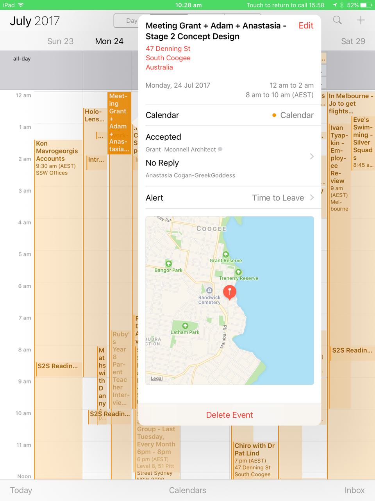

Make sure appointments have address details unless it's obvious for all attendees.

<!--endintro-->

[[badExample]]
| 

[[goodExample]]
| 

It's important to always add the address information in appointments when a third party is included. i.e.:

* A client meeting at your location
* A meeting at the client location

The exception is for internal meeting appointments:

You should invite a coworker to work with you in the boardroom (but not include the address)
