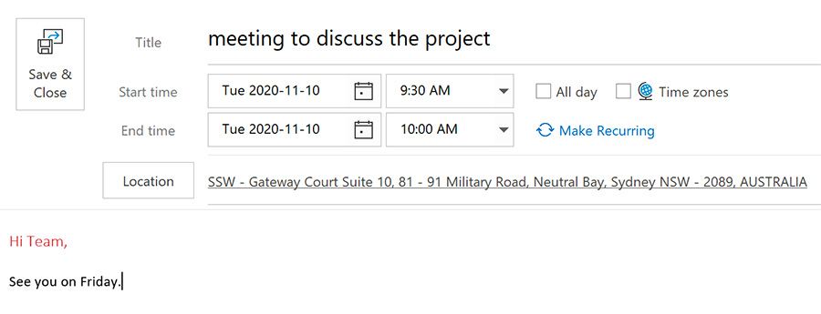
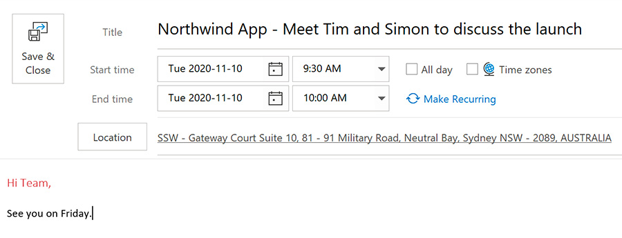

When sending an appointment, it's a good idea to choose your subject/title intelligently so that people can see all the information they need to see on the Subject of the Appointment.

For example, if the appointment is a meeting request you should include the names of the persons attending that appointment. Another example is flight bookings or hotel bookings. Including the flight number and/or Hotel name in the Appointment Subject so that you can see the information without having to open the item. Think about what the recipient sees in their calendar and try to make it as clear as possible.

<!--endintro-->
<dl class="badImage"><dt></dt><dd>Figure: Bad Example - appointment subject with very little information</dd></dl><dl class="goodImage"><dt></dt><dd>Figure: Good Example - Appointment subject with all of the relevant information shown</dd></dl>
CRM users making bookings should [keep their naming standards consistent.](/scheduling-do-you-have-a-consistent-naming-convention-for-your-bookings)

Related rules

* [Do you realize the importance of a good email Subject?](/do-you-realize-the-importance-of-a-good-email-subject)
* [Scheduling - Do you have a consistent naming convention for your bookings?](/scheduling-do-you-have-a-consistent-naming-convention-for-your-bookings)
