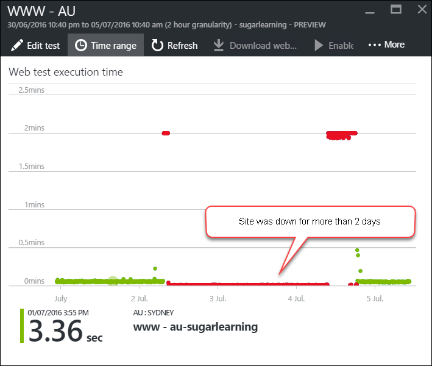
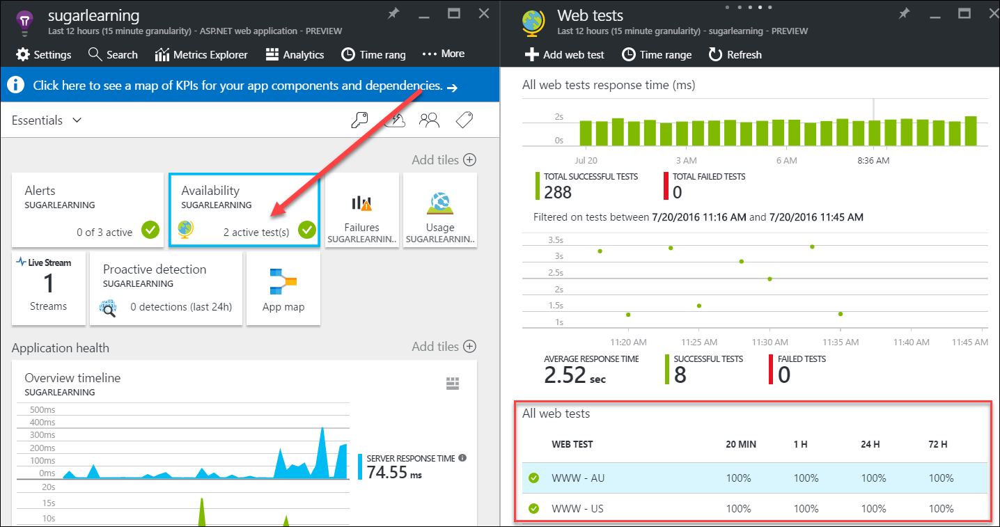

Nothing is worse than having your site down being unaware for a long period of time.
 
Application Insights can help you minimize the downtime by sending you an Email alert when your site becomes unavailable. You should create an availability test and enable the alert option as soon as your site goes live.

Bad example: Site was down over the weekend unnoticed

 Good example: Availability tests are created for multiple locations

 Good example: Email alert is enabled to minimize the downtime
