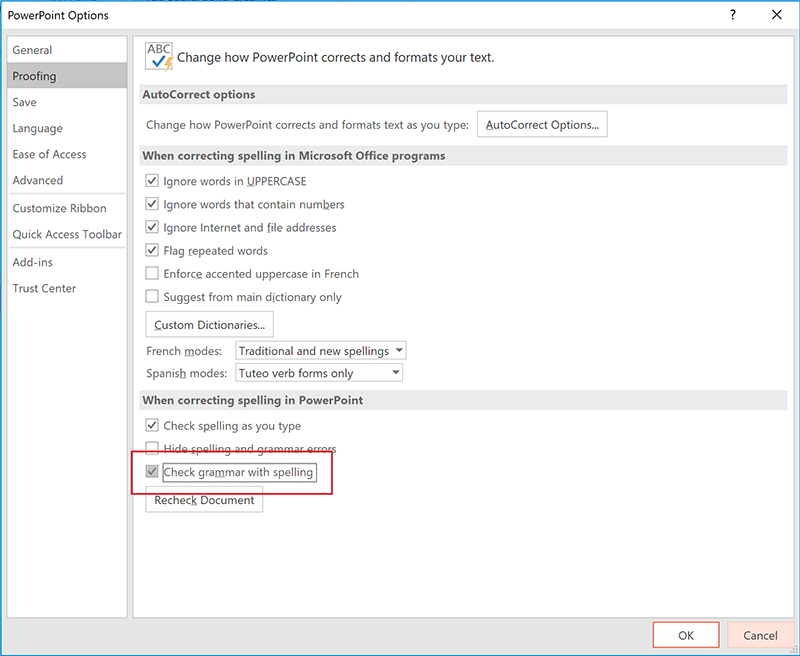
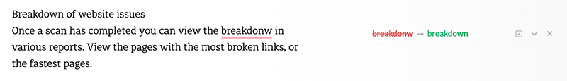

Improper spelling, grammar, and punctuation gives a bad impression of your company and can result in your message not being conveyed correctly. Emails with no full stops or commas are difficult to read and can sometimes even change the meaning of the text. And, if your program has a spelling checking option, why not use it?

<!--endintro-->

### Web Content

When on a web page, [install Grammarly Addon for Chrome](https://chrome.google.com/webstore/detail/grammarly-for-chrome/kbfnbcaeplbcioakkpcpgfkobkghlhen) so you can automatically check web content. For example, while editing in a CMS.
<dl class="image"><dt>  </dt><dd>Figure: A typo caught by Grammarly plugin  </dd></dl>
### Documents

When on Word, press  **F7** (or on the ribbon go to  **Review > Spelling & Grammar** ) to check your .docx text.
<dl class="image"><dt>  </dt><dd>Figure: Click on "Spelling & Grammar" button to check your web content</dd></dl>
### Presentation

When on PowerPoint , press  **F7** (or on the ribbon go to  **Review | Spelling & Grammar** ) to check your .pptx text.
<dl class="image"><dt>  </dt><dd>Figure: Click on "Spelling" button to check your web content</dd></dl>
You should also keep "Check grammar with spelling" checked in your PowerPoint  **Options | Proofing** :
<dl class="image"><dt>    
   </dt><dd>Figure: Make sure "Check grammar with spelling" is enabled </dd></dl>
### Web Content

Any other text can be checked manually. Go to [Grammarly](https://app.grammarly.com/), create a New Document and Paste your content to check your text.
<dl class="image"><dt>  </dt><dd>Figure: A typo caught by Grammarly </dd></dl>
### Related rule

* [Do you use Microsoft Word's spelling and grammar checker to make your web content professional?](/Pages/UseSpellingAndGrammarChecker.aspx)
