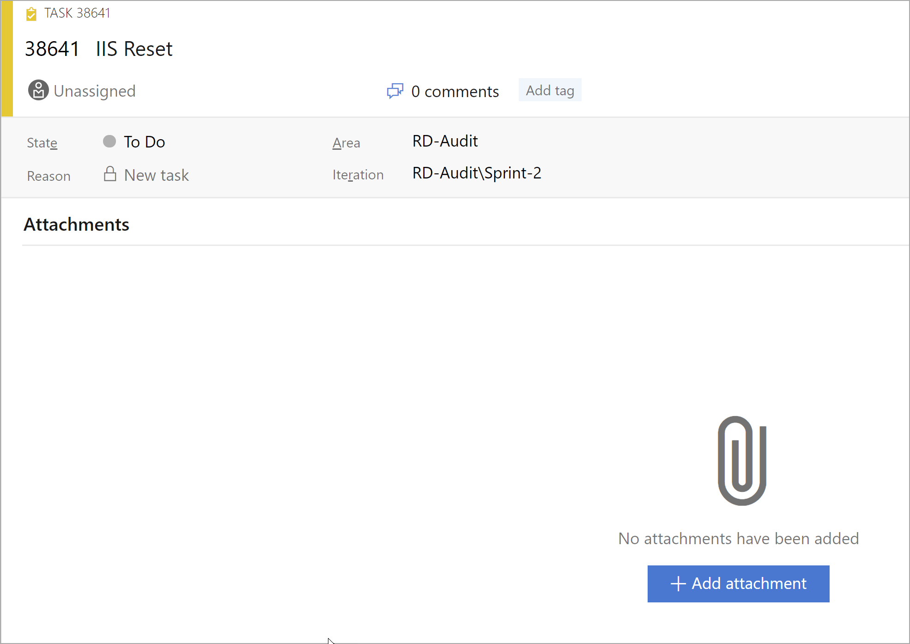
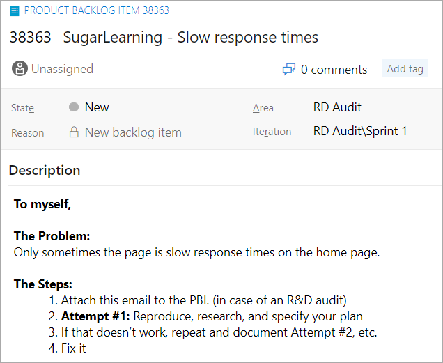
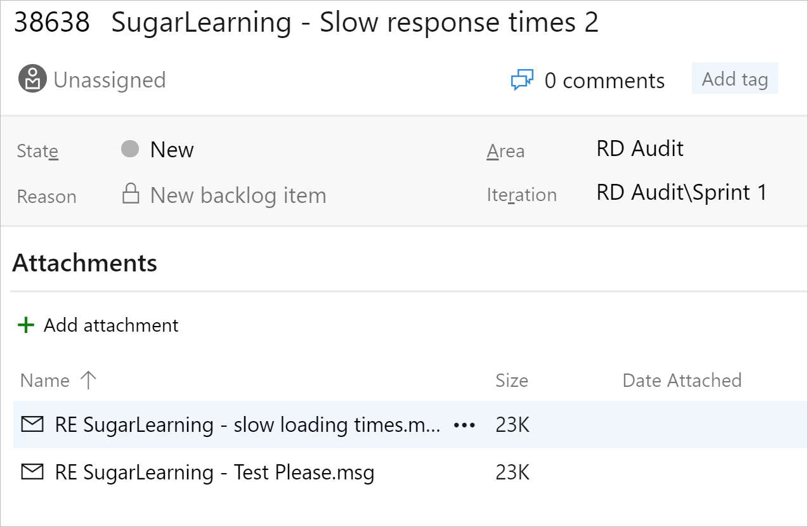

While working on a task or PBI, it is very important that you save any discussions or contextual information related to the work completed. This helps for future understanding of what happened as well as providing relevant documents that support your research claims.

<!--endintro-->

::: bad  
  
:::

::: good  
  
:::

::: good  
  
:::

When attaching an email to the PBI, consider whether or not a response to the email is required. The sender will usually expect a response when the issue is resolved. If a response is required, update the Acceptance Criteria with a note. E.g. 
Send a done email in reply to the original email (attached).

### Related rules

* [Do you know the 3 steps to a PBI?](/do-you-know-the-3-steps-to-a-pbi)
* [Dones - Do you send yourself emails?](/dones-do-you-send-yourself-emails)
