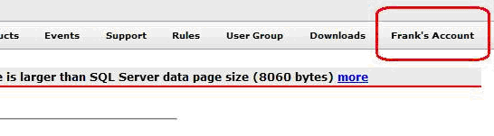
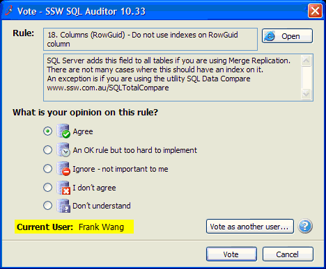
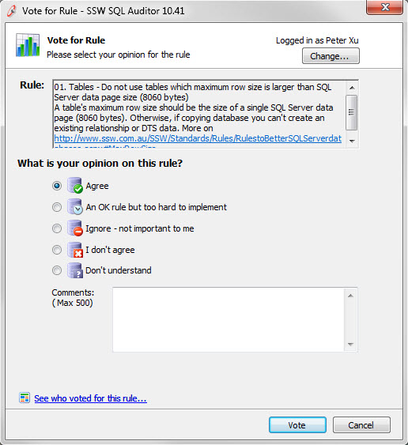
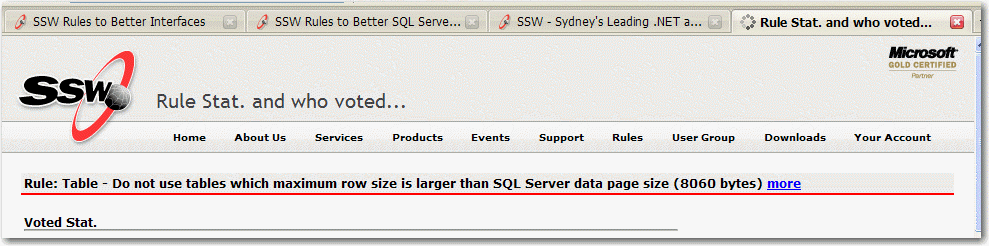

 
Remember to make the "logged in" state clear enough to help the user know the current state.
   ​  Figure: Bad Example on Web form - The user is logged in, but it isn't very clearFigure: Good Example on Web form - It's clear that the user is logged inFigure: Bad Example on Win form - The user is logged in, but it isn't very clearFigure: Good Example on Win form - It's clear that the user is logged inFigure: Good Example on Web form - Logged off stateFigure: Good Example – Metro UI’s new logged in state     

