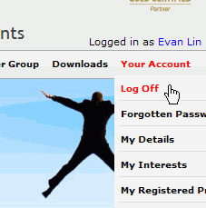
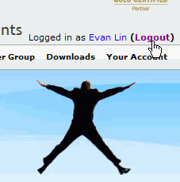

Although most of the sites have a 'Log off' submenu, we recommend adding a short                     cut next to the user name, this will make the 'log Off' operation more convenient.

<!--endintro-->

[[badExample]]
| 
[[goodExample]]
| 
