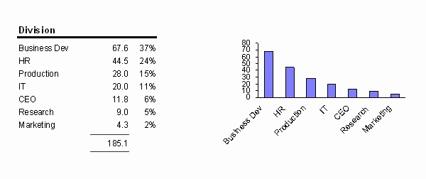

Graphs are a great way to display data in an easy to follow visual format. Some                      graphs, however, are easier to read than others. We recommend staying away from                      3-D Graphs and keeping it simple! If you have complex data, it's also a good                      idea to display 2 or 3 simpler graphs rather than one complex one - the aim of                      the game is to make digesting the information as simple as possible for your                      audience.
 
