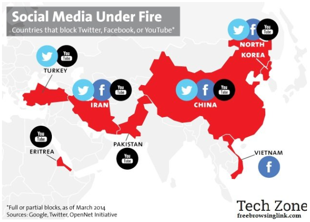

Modern websites can use 3rd party dependencies from many different sources. This can include js and CSS libraries from CDNs, video providers such as YouTube and other 3rd party APIs.

<!--endintro-->

Many of these services are completely blocked inside other countries. China, in particular, currently blocks all the below:

* Facebook
* Google
* YouTube
* Vimeo
* Twitter

Although China is the most well-known country for blocking sites, other countries also block services - like Google (e.g. Iran, Syria) and YouTube (e.g. Pakistan, Syria).

::: ok  
  
:::

If the runtime operation of your site depends upon these services, your website will either fail or perform poorly for users in China. Start by reviewing how many of these services are essential, what they do and whether there are China-based equivalents. The fewer external dependencies in your site, the easier it will be to Chinafy.

Every attempted request to a blocked service can add serious delays to your site's performance as each one can take over a minute to timeout. When loading a page, browsers have a limit on the number of simultaneous connections they will open. Google Chrome, for example, will support 6 connections to one domain and 10 connections overall. If all those connections get used attempting to connect to blocked resources, the entire page loading process can stall for minutes!

To measure the impact of this, you need to be able to browse the website from inside China. From there you can open the site and collect performance measurements from the network tab of your browser's dev tools.

::: bad  
  
:::

This situation can first be improved by finding and removing unnecessary dependencies.  Next, ensure that all required CSS and JavaScript content can be loaded - by either hosting within your site or using a CDN that is available from China.

Finally, you may find that there are features you still want to use elsewhere but need to disable for users in China. In this case, we recommend detecting the available services from the client. For more information read: Do you detect available services?
