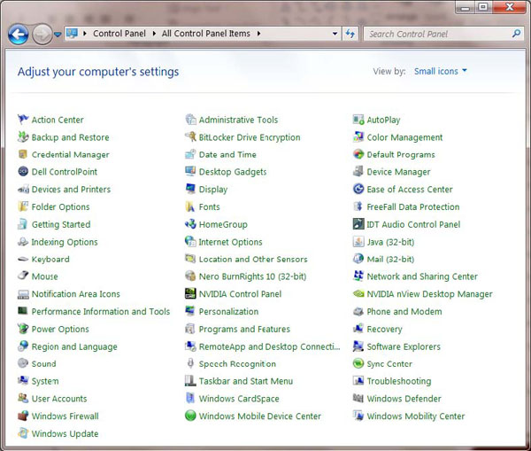
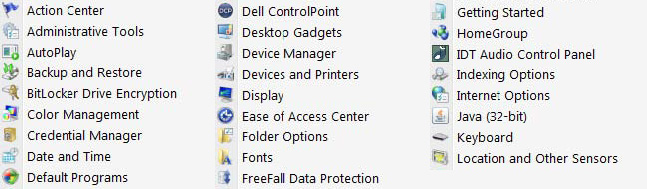

 
The search direction of a list should be obvious. When it comes to a multicolumn list, you should always head down instead of across for legibility.
   ​Figure: Bad example - The list columns go across instead of downFigure: Good example - The list is going down
