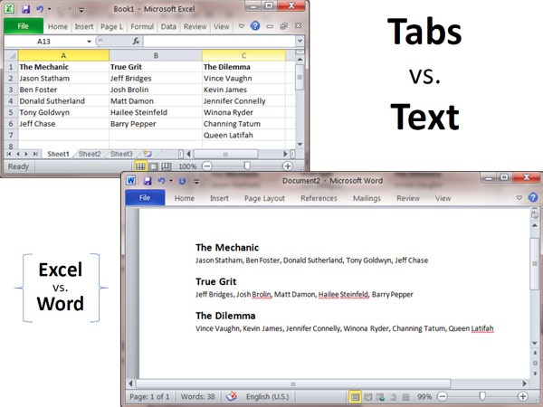

 
It's OK to use text because it's more natural, but use columns if you need:

- reordering
- side by side comparison
- totals

   ​<dl class="Image"><dt></dt>
<dd>Figure: While text looks friendlier, in terms of presenting data it's not the easiest to read</dd></dl>
