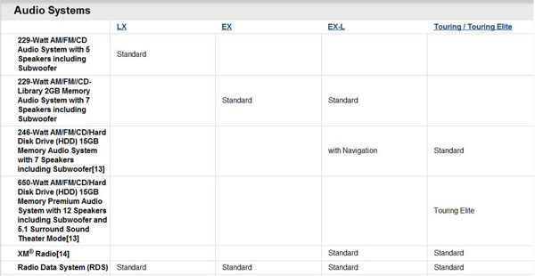
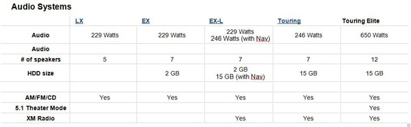

 <dl class="badImage"><dt></dt>
<dd>Figure: Bad example - Hard to read these columns</dd></dl>   ​<dl class="goodImage"><dt></dt>
<dd>Figure: Good example - The whole table has been re-written and is now easier to understand</dd></dl>
