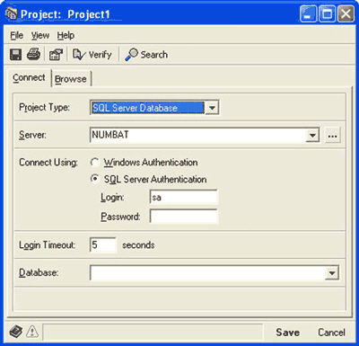
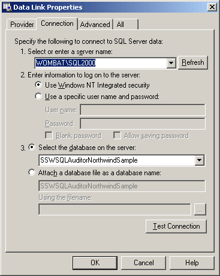
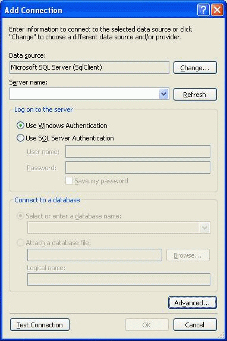
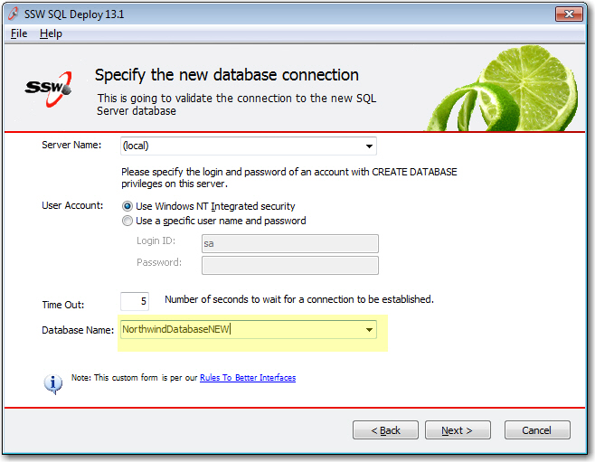

 
Why do people always invent ways of getting the same old server name and a database name? Look at this image from [Speed Ferret](http://www.ssw.com.au/ssw/Standards/DeveloperGeneral/SQLservertools.aspx#SpeedFerret) - one of my favorite SQL Server utilities.
   ​<dl class="badImage"><dt>  </dt><dd>Figure: Bad Example - Custom database connection screen in Speed Ferret</dd></dl>
While a nice form, it would have taken quite some developer time to get it right. Not only that, it is a little bit different than what a user has seen before. Now look at this UDL from one of our utilities [SSW SQL Auditor](https://www.ssw.com.au/ssw/SQLAuditor/):
<dl class="goodImage"><dt>  </dt><dd>Figure: Good Example - Standard Microsoft UDL dialog</dd></dl>
Every developer has seen this before - so use it. Better still, it is only a few lines of code: [B-Open UDL Dialog-DH.txt](https://gist.github.com/SSWConsulting/60cce3f7a65665d7dae2#file-b-open-udl-dialog-dh) 
<dl class="image"><dt>  </dt><dd>Figure: Coming in Visual Studio .NET 2005 Microsoft are yet to release an API to do this</dd></dl>
[Need extra information?](https://www.ssw.com.au/ssw/Standards/BetterSoftwareSuggestions/MSForm.aspx#InvokingOLEBDataLinkPropertiesDialog)

#### Exception

The above cannot be used when you want the user to create a new database. Microsoft does not supply an out of the box UI and there is no third party solution. Only in this case you have to create your own form.
<dl class="image"><dt>  </dt><dd>Figure: SQL Deploy uses its own custom form for "selecting" a database name</dd></dl>
