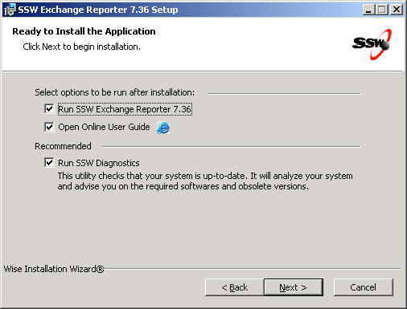
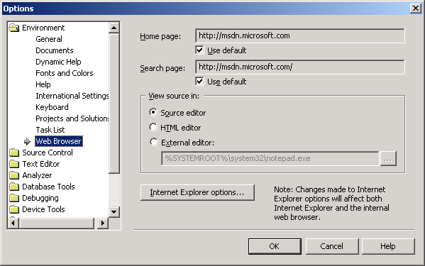

 
Group box should only be used when you want to notify the user the controls within it are really related, such as radio buttons.
   ​Figure: Bad Example - Inappropriate use of 'Group Box', there is nothing to be groupedFigure: Good Example - Use a line to organize different sectionsFigure: Good Example - VS.NET 2003 Options form, appropriate use of 'Group Box', the radio buttons are related to each otherFigure: Good Example - VS.NET 2012 Options form, also appropriate use of 'Group Box'
In other cases, you should avoid using group box and replace it with a simple line, this will save you some space on the form and help you organize your form more easily.

