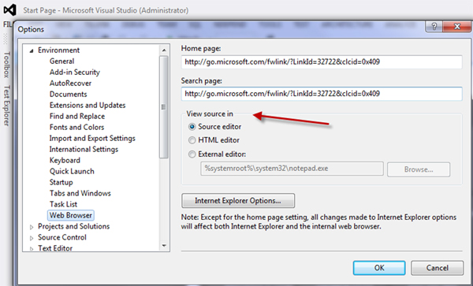

Group box should only be used when you want to notify the user the controls within it are really related, such as radio buttons.
   
[[badExample]]
| 
[[goodExample]]
| 
[[goodExample]]
| 

In other cases, you should avoid using group box and replace it with a simple line, this will save you some space on the form and help you organize your form more easily.
