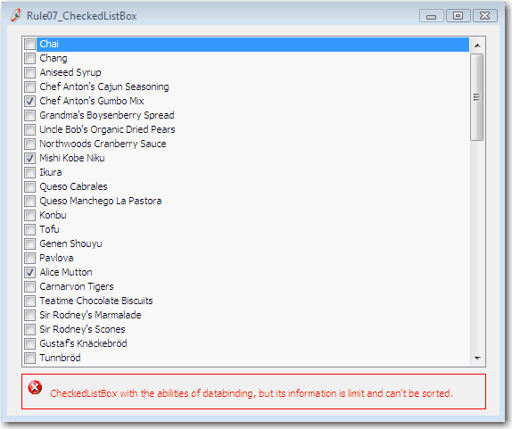
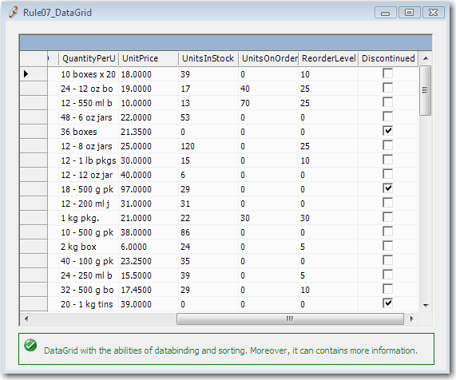

 
In Web we have:

- Grids E.g. http://demos.kendoui.com/web/grid/selection.html 

In Windows Forms we have a CheckedListBox. With a CheckedListBox you cannot:

- Sort data - always useful when there are more than about 20 rows
- Contain much information - can only show one field
- DataBind - always costs heaps of code

   ​​ <dl class="badImage"><dt>  </dt><dd>Figure: Bad Example - The CheckedListBox is limited</dd></dl><dl class="goodImage"><dt>  </dt><dd>Figure: Good Example - The DataGrid can show much more information (and if you use a 3rd Party eg. Telerik, then it can be pretty too)</dd></dl>
In Windows Forms, the code of DataGrid databinding is easier than that of CheckedListBox.
<dl class="badCode"><dt>
ProductsService.Instance.GetAll(Me.ProductsDataSet1) CheckedListBox1.DataSource = Me.ProductsDataSet1.Tables(0) CheckedListBox1.ValueMember = "ProductID" CheckedListBox1.DisplayMember = "ProductName" For i As Integer = 0 To CheckedListBox1.Items.Count - 1 Dim checked As Boolean = CType(ProductsDataSet1.Tables(0).Rows(i)("Discontinued"), Boolean) CheckedListBox1.SetItemChecked(i,checked) Next ​ 
</dt><dd>Figure: 8 lines of code to fill a CheckedListBox</dd></dl><dl class="goodCode"><dt>
ProductsService.Instance.GetAll(Me.ProductsDataSet1)
</dt><dd>Figure: One line of code to fill a DataGrid</dd></dl>
But the CheckedListBox is useful if only one field needs displaying.

