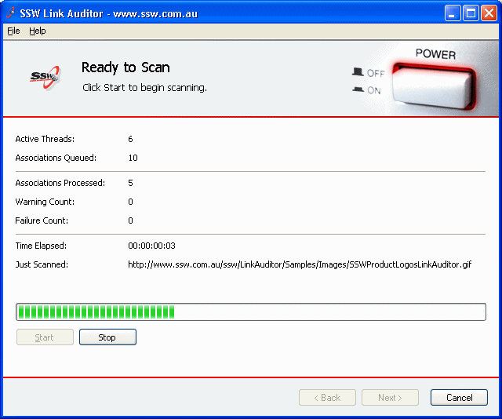

 If a button is unavailable, or clicking it will generate an error message or should have no effect, then the button should be disabled. However, buttons should not be hidden simply because they are unavailable as it confuses the user.   ​Figure: Good Example - The Start button is disabled in SSW Link Auditor after the scan has started
