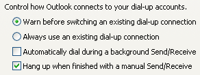

 
There are two aspects to this rule:
 
1. **Arrange Vertically**
2. If your user must choose from a variety of responses, or select from a number of items, using either radio buttons or check boxes, arrange the items vertically rather than horizontally as it makes the association much clearer. NOTE: You might want to disregard this rule if screen real estate is at a crucial premium.

Do you like apples? Yes No Cannot say 

| Do you like apples? |  | Yes |
| --- | --- | --- |
|  |   | No |
|  |  | Cannot say |
3. **Text on the Right**     The Option Group or Check Box should always be on the left, with the text following on the right. Once again, this makes it easy for the User to work out what is going on.
Figure: Good Example - Action on the left, text on the right

