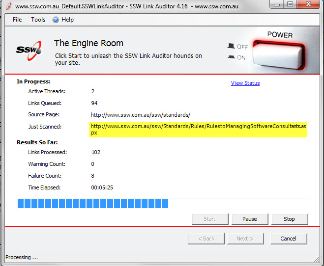
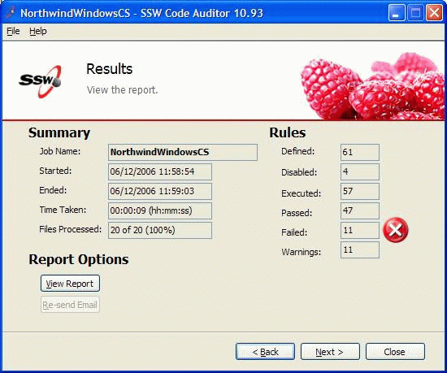

 
Use Label controls to display static text of the application. Eg. "Customer ID:"
Use Text Box controls to display data (results of calculations, information, records from a database, etc.).
   ​
The reasons are:

- users know it is data, not a label of the application
- users can copy and paste from the field

PS: One reason web UI's are nice, is that the information is always selectable/copyable.
Figure: Bad Example - Not only is the data cut off when you are using label, but you can't copy and paste the valueFigure: Good Example - Using Textbox controls makes the data obvious to users
As you can see you'll barely know the difference, so start using Textboxes for displaying data, that's good practice.

#### More Information

When using TextBox controls in Windows Forms, set them up like this:
Figure: Having the 'BorderStyle' Property set to Fixed3D is the best choice visuallyFigure: Make the text box Read-Only (users copying data is OK, changing is silly)
