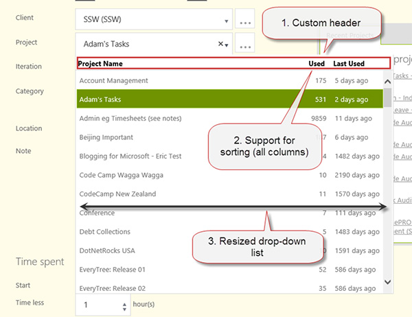
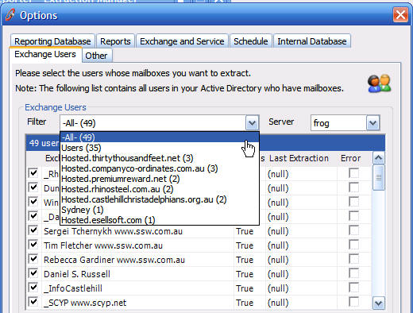

When designing your form, you should try to help your user whenever it's possible. So it's a good idea to include the number of results in ComboBoxes.

<!--endintro-->
For Web Pages 

::: good  
  
:::
 Feel free to use our sample:
1. Download and install Kendo UI Controls from [Kendo UI](http://www.kendoui.com/)
2. **HTML (Razor)** 
Create a combo-box that has a custom template. Use a code bellow as an example:


```
@(Html.Kendo().ComboBoxFor(x => x.EmpTime.ProjectID)
.AutoBind(true)
.Suggest(true)
.Delay(300)
.DataSource(source => source.Read(read => read.Action("ProjectNameAjaxBind", "Ajax")
.Data("function() { return {clientId : getClientId()}; }")
.Type(HttpVerbs.Post)))
.Height(450)
.DataTextField("DisplayText")
.DataValueField("Value")
.Filter(FilterType.Contains)
.Template(@"
<table class='comboBox-Projects'>
<tr>
<td class='projectName'>${data.DisplayText}</td>
<td class='projectTotalCount'>${data.UsedCount}</td>
<td class='projectLastUsed'>${data.LastUsedText}</td>
</tr>
</table>
")
.HighlightFirst(false)
.IgnoreCase(true)
.Events(e => e.Change("projectChanged").Open("onProjectOpened"))
)
```
3. **CSS** 
Customize the look & feel to suit your needs.

```
<p class="ssw15-rteElement-CodeArea">#projectsTableBorder {<br> border-bottom: 1px solid rgb(217, 217, 217);<br> margin: 0 -2px;<br> }<br> .comboBox-Projects#projectsHeader {<br> color: black;<br> font-weight: bold;<br> margin: 4px 16px 4px 4px;<br> }<br> .comboBox-Projects td.projectName {<br> width: 400px;<br> text-align: left;<br> }<br> .comboBox-Projects td.projectTotalCount {<br> width: 70px;<br> text-align: right;<br> padding-right: 16px;<br> }<br> .comboBox-Projects td.projectLastUsed { text-align: left; }<br> #projectNameHeader:hover, #projectTotalCountHeader:hover, #projectLastUsedHeader:hover {<br> cursor: pointer;<br> text-decoration: underline;<br> }</p>
```
4. **JavaScript** 
Use JavaScript to change the combo-box's behaviour.

```
<div id="projectsTableBorder" class="comboBox-Projects"><p class="ssw15-rteElement-CodeArea">// resize the drop-down list<br>function resizeComboBoxList(comboBoxListId, width) {<br> var list = $(comboBoxListId);<br> list.width(width);<br> var height = list.height();<br> list.children("ul").height(height - 25);<br>}<br>function onProjectOpened() {<br> resizeComboBoxList("#EmpTime_ProjectID-list", 600);<br>}<br>// execute sorting when a header column is clicked<br>function onClick_ColumnHeader(senderId, comboBoxId, fieldName) {<br> var column = $(senderId);<br> column.unbind('click');<br> column.click(function() {<br> sortComboBoxBy(comboBoxId, fieldName);<br> });<br>}<br>// sort any combo-box based on a field name<br>function sortComboBoxBy(comboBoxId, fieldName) {<br> var comboBox = $(comboBoxId).data("kendoComboBox");<br> var sortDescriptors = comboBox.dataSource._sort;<br> var direction = "asc";<br> if (typeof(sortDescriptors) != "undefined") {<br> var sortDescriptor = sortDescriptors[0];<br> if (typeof(sortDescriptor) != "undefined") {<br> if (sortDescriptor["field"] == fieldName) {<br> if (sortDescriptor["dir"] == "asc") {<br> direction = "desc";<br> }<br> }<br> }<br> }<br> comboBox.dataSource.sort({<br> field: fieldName,<br> dir: direction,<br> });<br>}<br>// prepare <br>$(document).ready(function() {<br> var projectsId = "#EmpTime_ProjectID";<br> var projectsListId = projectsId + '-list';<br> // prepend header to combo-box list. By default you only get <ul><br> $("<br> <br>Project Name</td>" +<br> "<td id='projectTotalCountHeader' class='projectTotalCount'>Used</td>" +<br> "<td id='projectLastUsedHeader' class='projectLastUsed'>Last Used</td>" +<br> "</tr></table>" +<br> "</div>")<br> .prependTo(projectsListId);<br> // register click events for each column<br> onClick_ColumnHeader('#projectNameHeader', projectsId, "DisplayText");<br> onClick_ColumnHeader('#projectTotalCountHeader', projectsId, "UsedCount");<br> onClick_ColumnHeader('#projectLastUsedHeader', projectsId, "LastUsedValue");<br>});<br>});<br></p></div>
```


### For Windows Forms


::: bad  
  
:::


::: good  
  
:::


::: bad  
  
:::


::: bad  
  
:::

We believe all combos should be able to be sorted ascending/descending and by popularity asc/desc.


::: good  
  
:::
