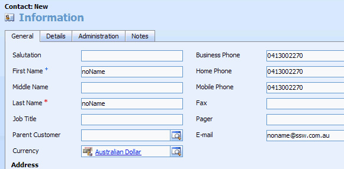
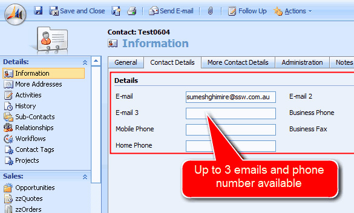
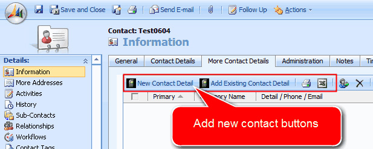
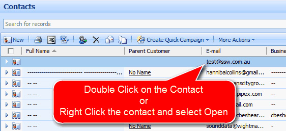
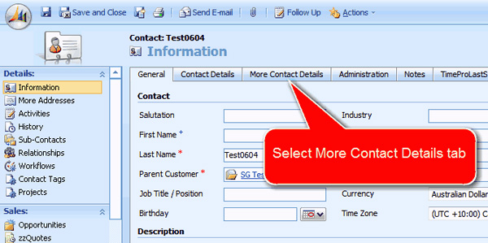
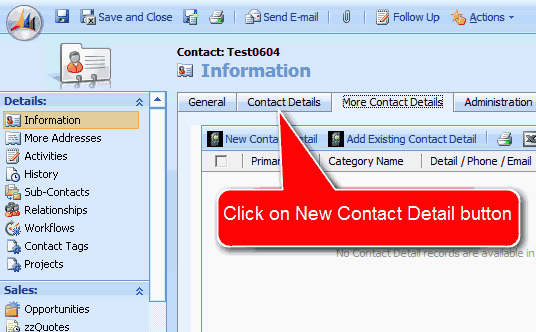
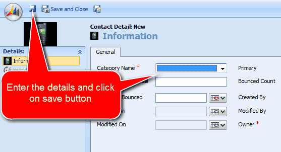

Out of the box CRM4 only enables a contact to have 3 phone numbers (home, business and mobile) + 3 email addresses (but only one visible). A customization that almost everyone needs is to remove this limitation (to allow contacts to have an unlimited amount of phone numbers and email addresses). 
<!--endintro-->

[[badExample]]
| 
There are a few customizations needed to get the SSW Contact Makeover:

* Show some hidden fields
* Make some form changes to move to a new tab
* Make a CRM frame (to add in a subform)
* Add some entities
* Add some form java script to hide the core Contact Details? tab when a user is             entering a new contact

[[goodExample]]
| 
[[goodExample]]
| (phone, fax, email etc)         
Q: So what is the end result? 
A: The end user experience to add a phone number is ..

(or right-click the contact and               select Open) Open          

(top               left)
