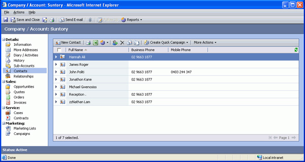
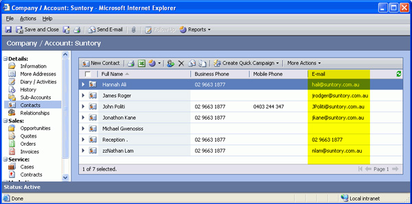

In default view for Associated Contact you cannot see the email address, it would           be better to customize it as an extra column.

<!--endintro-->
<dl class="badImage">          &lt;dt&gt;
            
          &lt;/dt&gt;
          <dd>
            Figure: Associated Contact View without the email address</dd>
        </dl><dl class="goodImage">          &lt;dt&gt;
            &lt;/dt&gt;
          <dd>
            Figure: Associated Contact View with the email address</dd>
        </dl>
It is easy to do this by import the [customisations xml files](http://www.ssw.com.au/ssw/Standards/BetterSoftwareSuggestions/CRM.aspx#Customizations).
