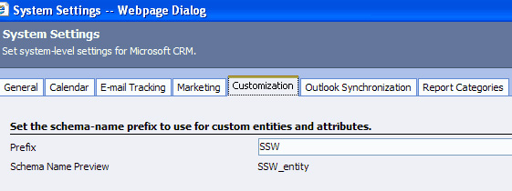
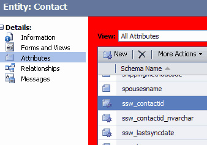

Note when you do a customization it gives it a prefix with the schema name - in           our case SSW. With this prefix you can easily distinguish customized attributes           from default attributes.

<!--endintro-->

