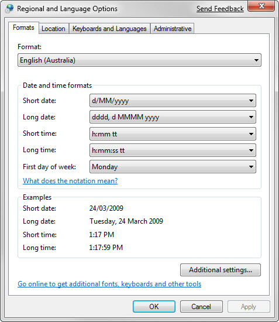
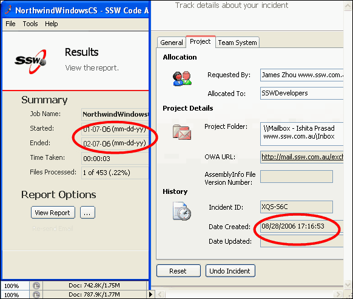
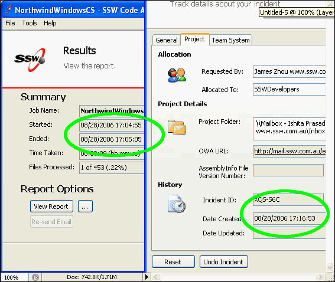

 
Date formats should always be kept consistent across your application, more importantly,                      it should be kept consistent with the operating system's regional settings otherwise                      this will cause significant confusion for your users.
  Figure: Operating System's Regional Settings  Figure: Bad Example - Two screens with inconsistent date formats Figure: Good Example - Two screens with consistent date formats
The best way to do this in your code is to grab the culture information from the application thread and use it to automatically format your Datetime data type. Do not use hard coded datetime formatting strings unless it's absolutely necessary.


```
startTimeTextBox.Text = resultResults.StartTime.ToString("dd/MM/yyyy hh:mm:ss");
```

Figure: Bad Example - using hard coded formatting string

```
'VB.NET
'Initial CultureInfo settings for the application
Public initialCulture As CultureInfo
...
...
txtDateCreate.Text = CType(txtDateCreate.Tag, System.DateTime).ToString(initialCulture.DateTimeFormat)
```

Figure: Good Example - Using culture info to format datetime
