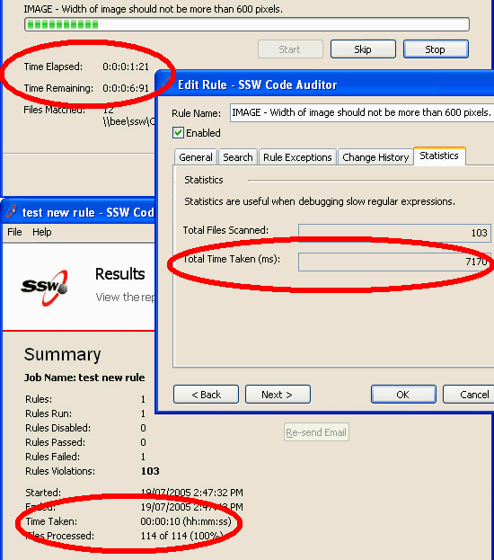
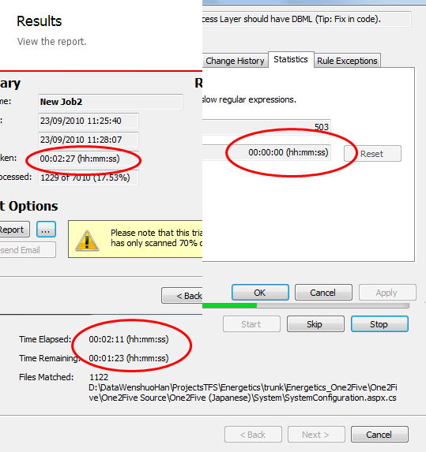

 
Time formats should be consistent across your application, to give the                      application a very professional and consistent look.
  Figure: Bad Example - Three screens with inconsistent time formats Figure: Good Example - Three screens with consistent formats
