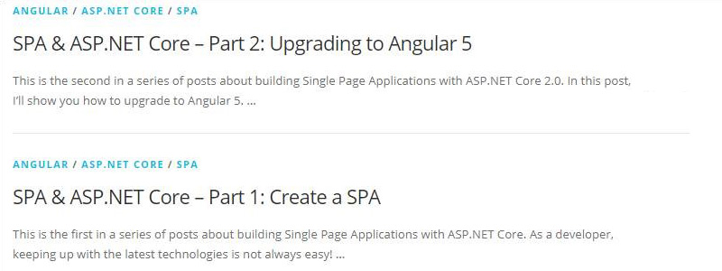

 ​A relevant featured image is a great way to add a splash of color to your blog and make your content visually appealing.
 ​Figure: Bad Example – the content might be interesting but it is not very appealing​Figure: Good Example – the content is more appealing
