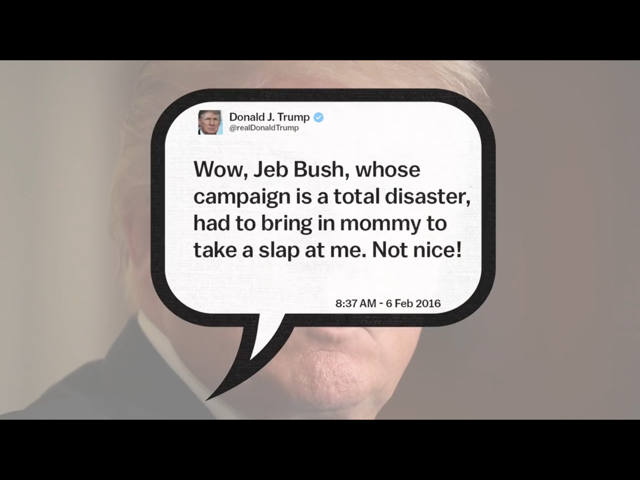

A lot of your audience will not always be looking at your video. A sweet sound to make you look at the video is a great idea.
Bad example: text on the screen without audio
 

E.g. Video on YouTube: Cory Booker: Why Trump should try being nice on Twitter http://youtu.be/8p5n0TbRFEk
