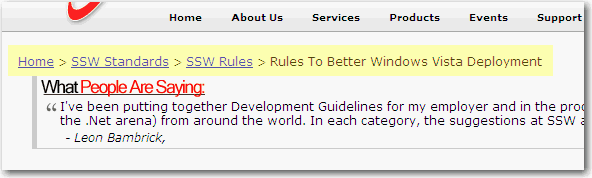

 
Keep a breadcrumb on every page is necessary. With this navigation tool,  users can easily location themselves and find the targets quickly. But  don't link yourself!
 Figure: The breadcrumb
So every page should have a SiteMapPath Control.
 ID="SiteMapPath1" runat="server" SiteMapProvider="SiteMapProvider1"/> Figure: SiteMapPath Control (Note:        [Code Auditor](http://www.ssw.com.au/ssw/redirect/ssw/CodeAuditor.htm) checks for the yellow highlighted text)
