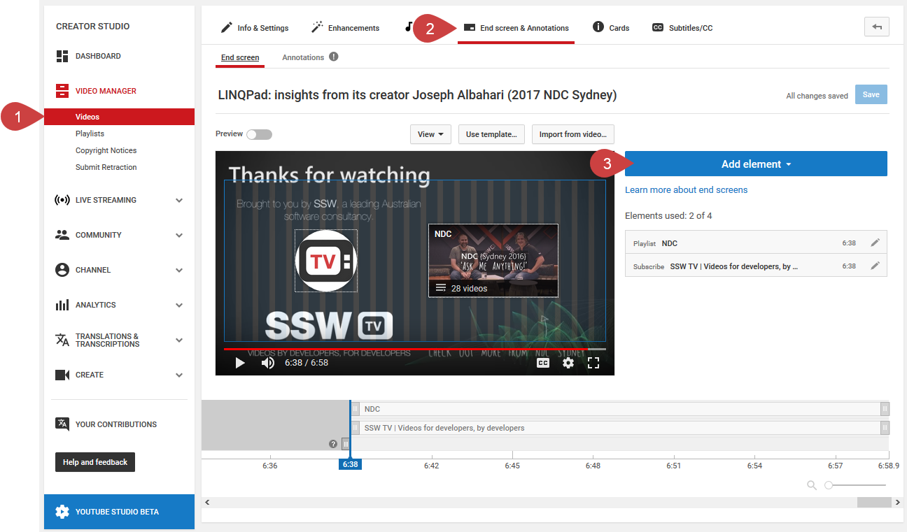
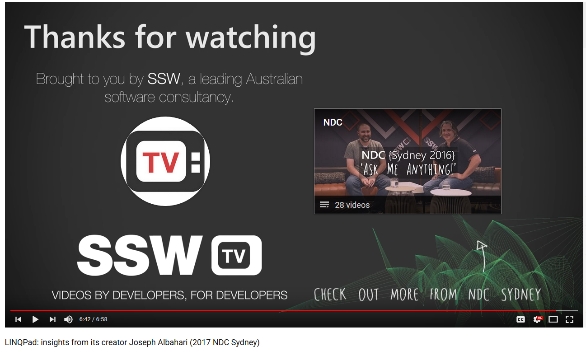

On top of [YouTube Cards](/_layouts/15/FIXUPREDIRECT.ASPX?WebId=3dfc0e07-e23a-4cbb-aac2-e778b71166a2&TermSetId=07da3ddf-0924-4cd2-a6d4-a4809ae20160&TermId=b29aa3cb-9857-42f3-82c7-af8594b9fd9a), you can also add an end screen for the last seconds of your video which is a perfect time to add a CTA (Call to Action)!
 
End screens help to avoid viewers to go away by suggesting to them the next content they can watch. The idea remains similar to cards \*LINKBACKANDFORTH\*: you display a CTA to your viewers so they can watch more of your content. End screens tend to work better (viewers can decide to ignore cards to keep watching the video which is okay as it increases the chance they will finish your video- increasing session time), as viewers are now done with your video and need to look for another video to watch. Hold their hand by promoting up to four elements which can be:

- Another video or playlist
- A subscribe button
- Another channel
- A link to an approved website

Keep in mind that end screens must include at least one video or playlist element (i.e. you can’t just display a subscribe button on its own).
Your end screen shouldn’t overlap actual video content so you should leave up to 20 seconds for this to fit into at the end of your video (note that 20 seconds is the maximum duration of an end screen). This should just show background content such as an image, plain screen, or some unobtrusive background video content.

Good example: An example of an end screen featuring a Subscribe button (the SSW logo) and a playlist (which the video is from). 

You can see a demo at the end of our [LINQPad: Insights from its creator Joseph Albahari (2017 NDC Sydney)](https://www.youtube.com/watch?v=4Hpl4Gq-yNE) video (from 6:39).
