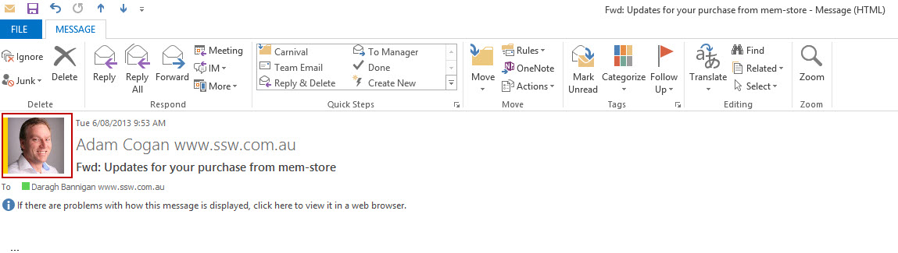

 You can upload Staff profile pictures into Active Directory. Exchange and Lync will automatically use these profile pictures.  
​Using a free third party tool AD Photo Edit tool which can be downloaded from     http://www.cjwdev.co.uk/ you can upload Staff profile pictures into AD. You need to run the application with Domain Admin rights. After you have uploaded the picture for a user it will take some time for the change to be replicated through to Exchange and Lync if you have use these solutions.
<dl class="image"><dt></dt><dd>Figure: Profile picture imported from AD into Exchange </dd></dl><dl class="image"><dt> </dt><dt>​Figure: Profile picture imported from AD into Lync</dt></dl>
