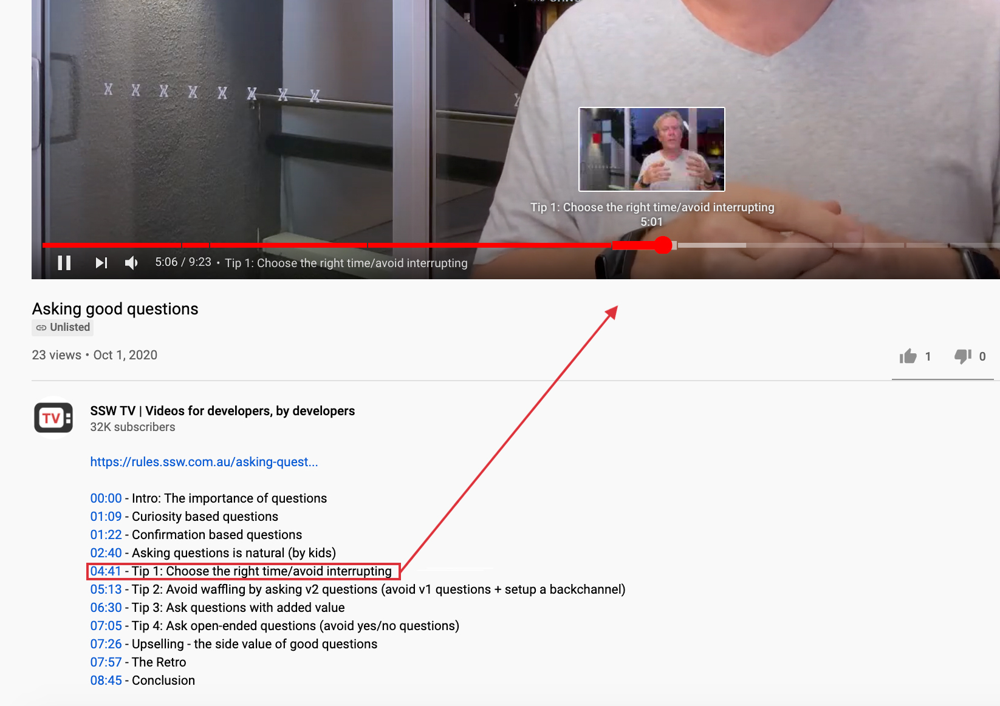

You can add the time when each section starts in a video. This is especially useful on training sessions and presentations.
 
Steps to do this:

1. Go to YouTube in your browser
2. Play the video through the timeline until you reach the moment you want a link to
3. Stop the video and take a note on the time
4. Type in the time stamp (E.g. 5:32) on the video description 
**Note:** This also work on comments
5. Save and YouTube will automatically add a link to that exact time of the video

