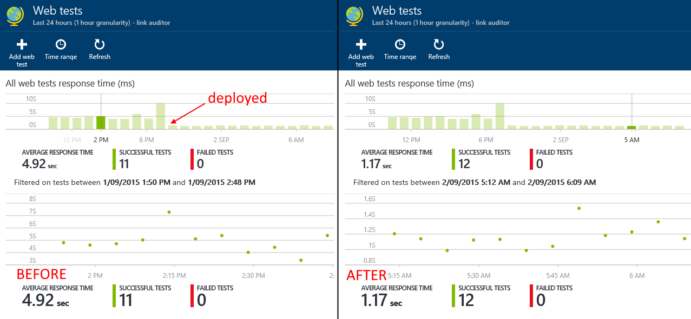
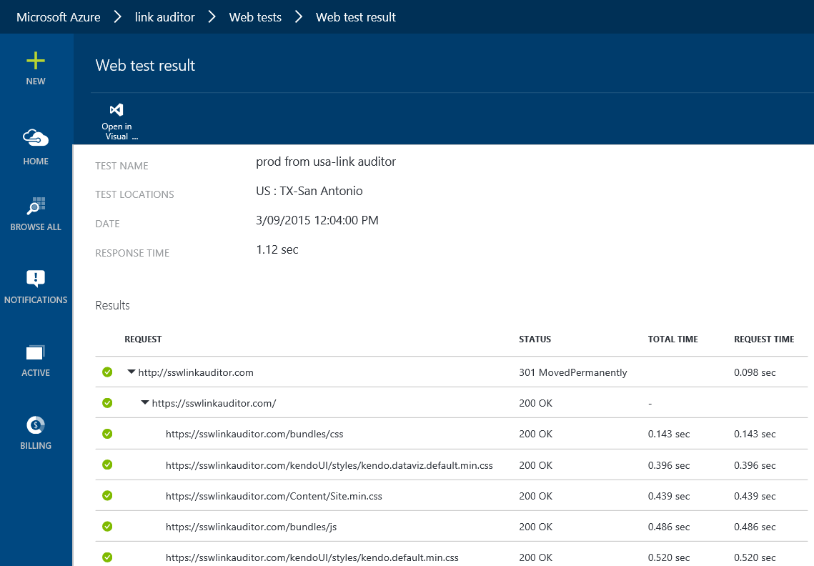

As soon as you have configured Application Insights, you should immediately add a Web Test to track general performance trends over time. You can configure test agents to access your application from different locations around the globe to give a general idea of what users will experience.
 
Instructions on how to add Web Tests can be found on MSDN [https://azure.microsoft.com/en-us/documentation/articles/app-insights-monitor-web-app-availability](https://azure.microsoft.com/en-us/documentation/articles/app-insights-monitor-web-app-availability/)

Setting up a Web Test will allow you to query and see how the performance of your application has  changed over a period of time and to help you spot any anomalies. It can be useful to query over a long period of time (e.g. a year) and see if the performance has stayed the same or if there have been any regressions in responsiveness.
 Good Example - You can clearly see the point where we deployed a fix to production to improve the initial page load. 
You have the ability to drill down into web test results, to get an overview of the response time of the resources on a page. This can help discover if certain resources are slowing the response time.
  Good Example - Reviewing the Web test results, provides vital information .
