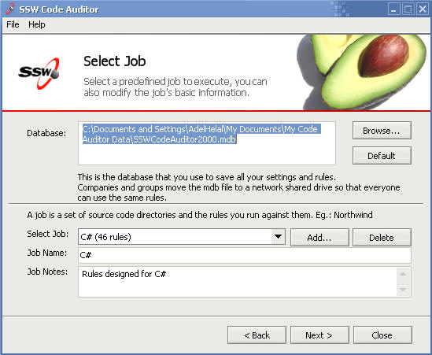
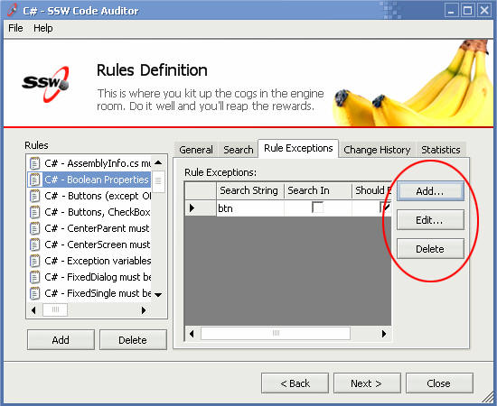
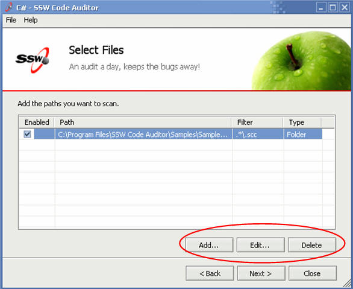

 
Usually there are problems fitting buttons next to datagrids or  listboxes when trying to imply that those buttons add functionality to  the datagrid or listbox.
 Figure: Bad Example - This form places the Add and Delete buttons in the top right.Figure: Buttons aligned vertically, however they cut off useful information in the datagrid (Better)Figure: Good Example - Buttons align horizontally at the bottom right of the grid which provides plenty of room for then needed information
