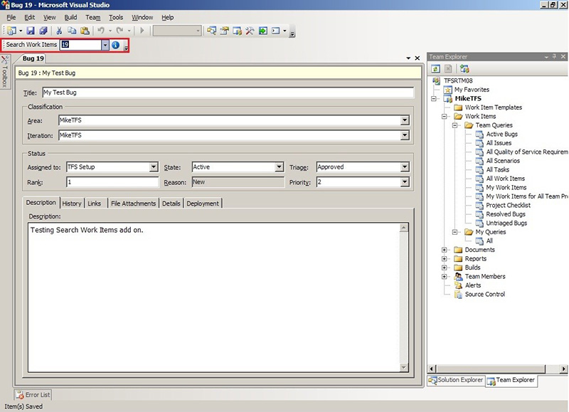
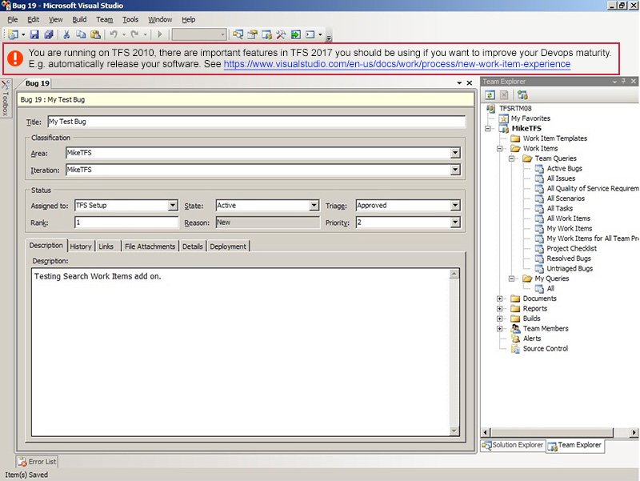

Your software is deployed. How do you tell users months or years later, important information?

This primarily affects Windows clients but even web clients shouldn't need a new version to give a new message.

Most software is deployed without any mechanism to insert a message in older software.
 
Messages might range from helpful tips that are undiscovered that would help a user do their job better?
Or helpful to remind old customers to get off their old version. 
Eg. Sometimes customers are just not aware that their TFS or CRM installation is years old?

