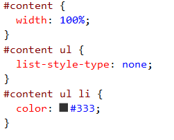
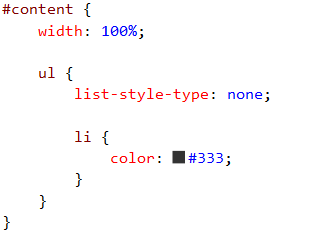

Writing CSS is easy. Writing a lot of CSS can become unweildy and unmanageable. Using LESS CSS helps you segment and organise your css logically and compiles down to regular css so there's extra steps to get up and running. 
The key advantage to using LESS CSS is nested selectors. Instead line after line of specific css selectors you can nest them and they will compile down for you. Check out this example:
Bad Example: Using regular CSS, you repeat yourself a lotGood Example: Using LESS, we can structure our css better.
The LESS CSS above compiles down to the regular CSS shown above.
