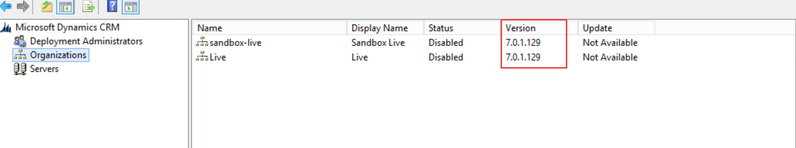

Make sure CRM 2015 update rollup 1 has been applied before upgrading to CRM 2016.

<!--endintro-->
 **Note:** You might come accross the error below while applying CRM 2015 update rollup 1 **Solution:** 
1. Make a backup of the file MetadataDiffs.xml from “C:\Program Files\Microsoft Dynamics               CRM\Setup\Serviceability\Latest\Actions\_Org\Install”
2. Open the file MetadataDiffs.xml from “C:\Program Files\Microsoft Dynamics CRM\Setup\Serviceability\Latest\Actions\_Org\Install”
3. Remove the entry about the index “cndx\_BusinessDataLocalizedLabel”. This is found at the very end of the file:

| &lt;index Name="cndx\_BusinessDataLocalizedLabel"&gt;      &lt;EntityId&gt;4ba1569e-3c9c-4d9f-99ea-b61fb08d7f97&lt;/EntityId&gt;      &lt;IsClustered&gt;1&lt;/IsClustered&gt;      &lt;IsUnique&gt;1&lt;/IsUnique&gt;      &lt;IndexType&gt;6&lt;/IndexType&gt;     &lt;IsPrimaryKey&gt;0&lt;/IsPrimaryKey&gt;      &lt;attributes&gt;        &lt;attribute AttributeId="d88e1df3-b5b3-42f3-9ffa-007f22951dd4" IsSystemManaged="1" order="0" /&gt;        &lt;attribute AttributeId="bb23d3c8-8d18-40d3-9519-66101a8cae34" IsSystemManaged="1" order="1" /&gt;        &lt;attribute AttributeId="976e1053-5faa-4c3f-be6e-669acfec9d5a" IsSystemManaged="1" order="2" /&gt;        &lt;attribute AttributeId="e81341c4-4d4a-4977-98eb-6597fcde2cc4" IsSystemManaged="1" order="3" /&gt;      &lt;/attributes&gt;    &lt;/index&gt; |
| --- |
4. Close Deployment Manager
5. Start Deployment Manager
6. Start the organization update from Deployment manager.
7. Run the following query on the organization DB to manually recreate the index

| IF EXISTS (SELECT \* FROM sys.indexes WHERE name = 'cndx\_BusinessDataLocalizedLabel' AND OBJECT\_NAME(object\_id) = 'BusinessDataLocalizedLabelBase') DROP INDEX [cndx\_BusinessDataLocalizedLabel] ON [BusinessDataLocalizedLabelBase]; IF NOT EXISTS (SELECT \* FROM sys.indexes WHERE NAME = 'cndx\_BusinessDataLocalizedLabel' AND OBJECT\_NAME(object\_id) = 'BusinessDataLocalizedLabelBase') BEGIN TRY  CREATE UNIQUE CLUSTERED INDEX [cndx\_BusinessDataLocalizedLabel] ON [BusinessDataLocalizedLabelBase]([ObjectId] ASC, [ObjectIdTypeCode] ASC, [ObjectColumnNumber] ASC, [LanguageId] ASC) WITH (FILLFACTOR = 80, MAXDOP = 4, SORT\_IN\_TEMPDB = ON, ONLINE = ON) END TRY BEGIN CATCH  CREATE UNIQUE CLUSTERED INDEX [cndx\_BusinessDataLocalizedLabel] ON [BusinessDataLocalizedLabelBase]([ObjectId] ASC, [ObjectIdTypeCode] ASC, [ObjectColumnNumber] ASC, [LanguageId] ASC) WITH (FILLFACTOR = 80, MAXDOP = 4, SORT\_IN\_TEMPDB = ON) END CATCH |
| --- |
8. Restore the file MetadataDiffs.xml to its original state using the backup taken at step 1.

| Database update install failed for orgId = 011d5962-3475-4df9-a123-c3ecaf88b048.  Continuing with other orgs.  Exception: System.Reflection.TargetInvocationException: Exception has been thrown by the target of an invocation. ---&gt; System.Data.SqlClient.SqlException: The current transaction cannot be committed and cannot support operations that write to the log file. Roll back the transaction.  Uncommittable transaction is detected at the end of the batch. The transaction is rolled back. |
| --- |

 **Figure:   version after applying CRM 2015 update rollup 1** Source from: [Error updating Microsoft Dynamics CRM 2015 0.1](https://www.remotingcoders.com/Blogsite/Lists/Posts/Post.aspx?ID=83)
