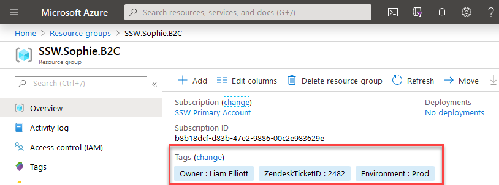

To help maintain order and control in your Azure environment, applying tags to resources and resources groups is the way to go.

Azure has the Tag feature, which allows you to apply different Tag Names and values to Resources and Resource Groups:
 

You can leverage this feature to organize your resources in a logical way, not relying in the names only. E.g.

- **Owner tag:**  You can specify who owns that resource
- **Environment tag:** You can specify which environment that resource is in

**Tip:**  Do not forget to have a strong naming convention document stating how those tags and resources should be named. You can use this Microsoft guide as a starter point:     [Recommended naming and tagging conventions](https://docs.microsoft.com/en-us/azure/cloud-adoption-framework/ready/azure-best-practices/naming-and-tagging).
