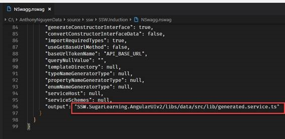

If your changes to your WebAPI break your client, then you want to know right away.

Using NSwag you should generate your API client eg. Angular Client.

- You run nswag.exe on the post-build event
- Nswag will generate the client code and update the API client file directly

 ​
[[goodExample]]
| 

Now this is automated this is no longer a concern we need to deal with.

**More info:**http://www.codingflow.net/building-single-page-applications-on-asp-net-core-2-1-with-angular-6-part-3-implementing-open-api/​
