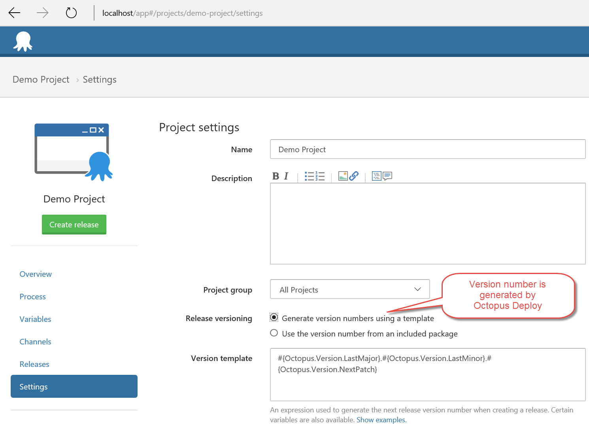
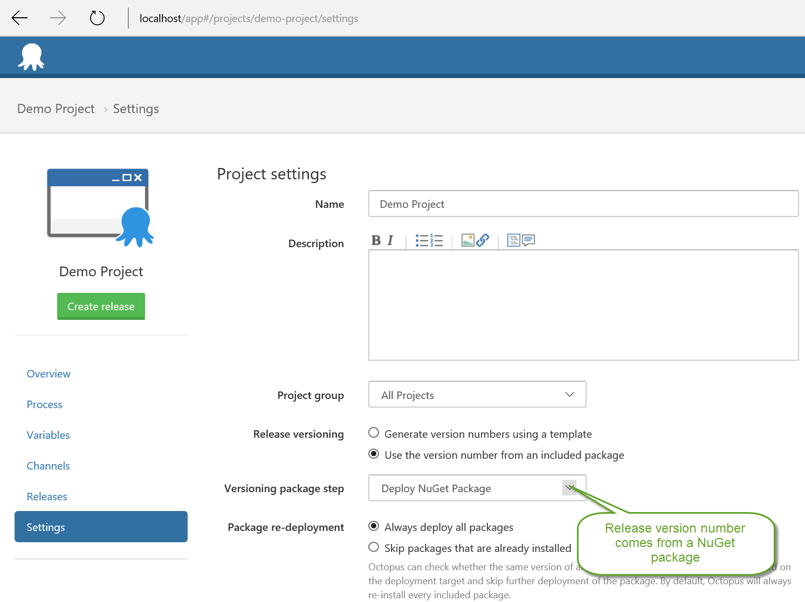

Every release needs to have a version number. However, version numbers need to be generated during the Build phase not the Release.

<!--endintro-->

Imagine the following scenario: Your Build system generates a NuGet package with version 1.0.4.5 that is pushed to Octopus Deploy NuGet feed. In Octopus Deploy you create a release using the default configuration. When you create a new release you will see 0.0.1 instead of 1.0.4.5. As you can imagine, it is impossible to tell from the release what version number of the application was really deployed. Hence you should change the versioning and use the package version instead.

::: bad
Bad Example - Version number is auto-generated by Octopus Deploy

:::

::: good
Good Example - Version number is inherited from a NuGet package

:::
