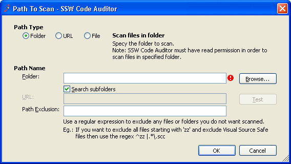
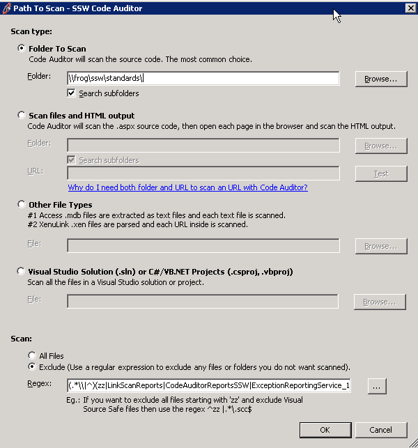

 
If the form controls are different entities, they usually have different  data and different validation, thus they should not be combined.
                    Having the controls separated also make the form easier to read.
 <dl class="badImage"><dt>
      
   </dt><dd>Figure: Bad Example - Different entities are combined</dd></dl><dl class="goodImage"><dt>
      
   </dt><dd>Figure: Good Example - Different entities are separated</dd></dl>
