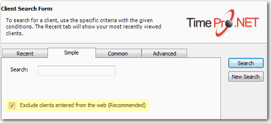

When there are too many choices always Default to the most common ones.  Then add a check box to allow the advanced users to turn off the common  choices. E.g.
 
[greyBox]
 [x] Only include common choices  
[/greyBox]

Likewise in a contacts database where you have entries from all around the world it is good to add a check box on the search screen similar to the following:

[greyBox]
 [x] Only include customers that have been updated by employees (not directly entered from the web) 
[/greyBox]

A good example on that the checkbox on the search screen of TimePRO.NET.

Read our rule on     [Validation - Do you avoid capturing incorrect data?](http://www.ssw.com.au/ssw/Standards/Rules/RulestoBetterInterfaces-Controls.aspx#AvoidIncorrectData)
