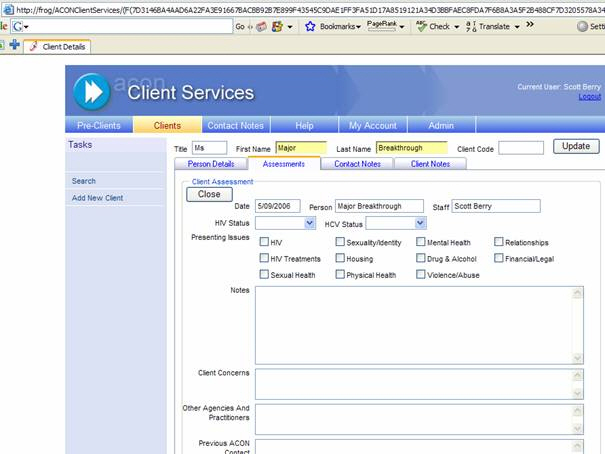
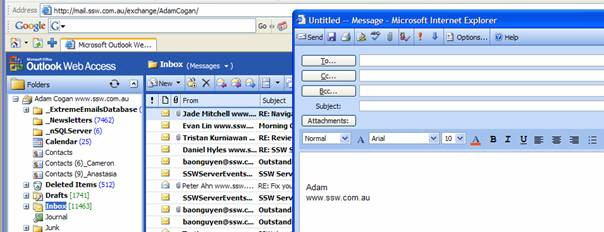
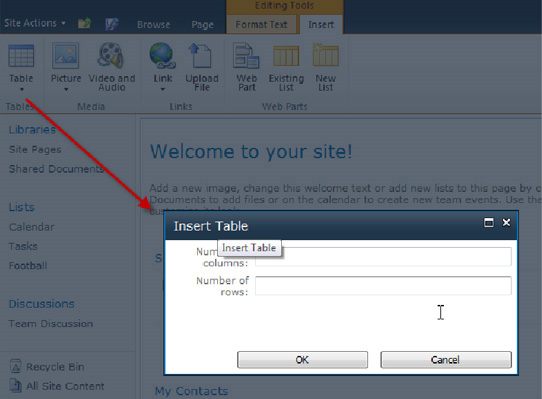

For any case of 'Add New', choose to open a new window (popup) for entering data.
 

[[badExample]]
| 

It is better to open in a new form, reasons being:

- It is better for the user in terms of clarity. The change of view to data entry form can be a surprise
- It is better to code e.g. if you are using this control in a couple of places you may need to show or hide 'Save' buttons etc. Otherwise, it is a pain to make it behave differently in different contexts.

However, you do need to call back on save and requery it.
 Use a modal form and requery it (DON'T use JavaScript, instead use the Modal Popup Form Example)
 An example of this is in Outlook with the 'New' button.

[[goodExample]]
| 

