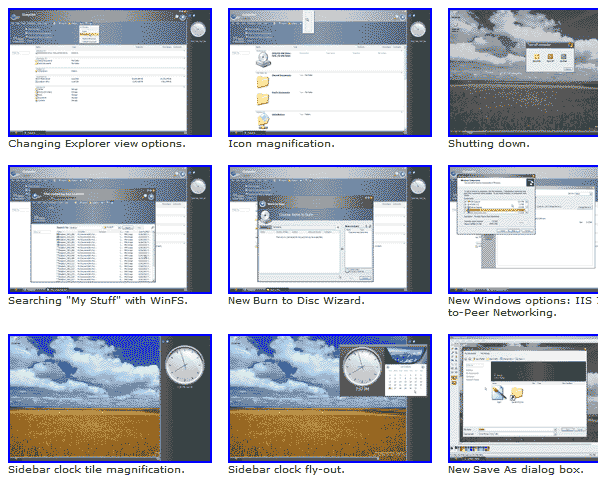

Many sites have screenshot galleries that offer a list of all the screens within an application, and an option to enlarge them. There's just one problem: you can't see what they contain!
 
[[badExample]]
| 
What we suggest as an alternative is to have one large image - full size - (and possibly a list of descriptions) to allow users to have a large screenshot to view right from the get go. This might look something like:

[[goodExample]]
| 
Our [Code Auditor User Guide](https://www.ssw.com.au/ssw/CodeAuditor/UserGuide.aspx) provides a good example for this rule.
