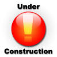

If all you have time to ftp up is a couple of simple html pages with few contact     details and a brief "About Us", then leave it as that. Writing "Under Construction"     says "We have a few ideas, but we really just don't have the resources to get our     website together at the moment." Bad idea.
 

