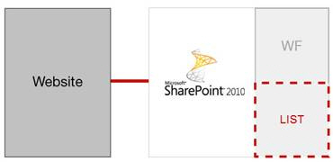

If you are planning to use Workflow, use Workflow with SharePoint List instead of BCS. Because Workflow cannot be associated directly with external lists. The reason is data is not stored in SharePoint, so the Workflow cannot be notified when items change.

BCS doesn't have WorkFlow support

Use WorkFlow with SharePoint List
