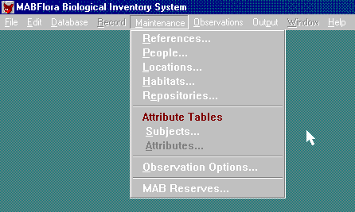

 
Using a separate menu to maintain ComboBoxes is never a good idea. A  better solution is to use an ellipses button to drill down into the  menu.
 Figure: Bad Example - Menu driven ComboBox maintenance formFigure: Good Example - Use ellipses to drill down into a ComboBox maintenance form
